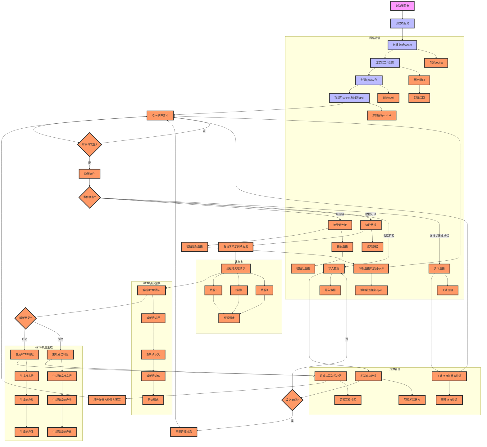

# C++ WebServer Project Information

This is a high-performance Web server project based on C++ implementation , using multi-threaded epoll concurrency simple model , the basic processing flow of the HTTP protocol . This project can be used as a practical project as learning network programming , but also as a basic framework for building more complex Web server . (This project refers to nowcoder's linux high concurrency server development course content and github part of the open source project)

/

这是一个基于C++实现的高性能Web简易服务器项目，采用多线程+epoll的并发模型，实现了HTTP协议的基本处理流程。本项目为学习网络编程的实践项目，也可作为构建更复杂Web服务器的基础框架。（本项目参考nowcoder的linux高并发服务器开发的课程内容以及github上部分开源项目）
## Core features

process_graph:

### Concurrent processing
- Using the concurrency model of multithreading + epoll.
- Implement a thread pool to handle concurrent requests, avoiding frequent thread creation and destruction.
- Use epoll ET edge trigger mode to realize efficient event processing.
- Use EPOLLONESHOT to ensure that a socket connection is processed by only one thread at any given time.

### HTTP support
- HTTP GET method support
- Support HTTP GET method for parsing and responding to HTTP requests.
- Supports HTTP long connection (Keep-Alive).
- Support for static resource access
- Implemented complete HTTP error handling (400, 403, 404, 500 and other status codes)

### Performance optimizations
- Optimize file transfers using memory mapping (mmap).
- Improve data sending efficiency by using writev to distribute writes.
- Implement port multiplexing
- Using non-blocking I/O to improve concurrency performance

### Synchronization
- Encapsulate mutex, condition variable and semaphore.
- Thread synchronization and thread safety
- RAII mechanism for resource management

## Project deficiencies

### Functional limitations
- Only GET method is supported. Other HTTP methods such as POST are not supported.
- Only supports GET method, no other HTTP methods such as POST.
- HTTPS protocol is not supported.
- Lack of access control and security mechanisms.

### Project integrity
- Lack of logging system, not conducive to troubleshooting
- Lack of logging system, which is not conducive to troubleshooting.
- Code comments and documentation are not perfect.
- Lack of unit test and performance test data

### Performance improvement
- Lack of timer mechanism to handle timeout connections
- Lack of efficient memory pooling
- No load balancing.
- Load balancing is not implemented. Concurrency performance can be further optimized.

### Future development direction

1. Functionality Extension
   - Add support for HTTP methods such as POST.
   - Implement dynamic content processing
   - Add HTTPS support
   - Implement access control and security mechanism

2. Project optimization
   - Implement complete logging system
   - Add configuration file support
   - Add unit tests
   - Improve the project documentation

3. Performance Improvement
   - Implement timer to handle timeout connections
   - Add memory pool
   - Load balancing
   - Optimize concurrency handling mechanism

4. Architecture Improvement
   - Optimize code structure and improve scalability
   - Implement modularized design
   - Reduce code coupling
   - Add plug-in mechanism

This project, although there is still a lot of room for improvement, has already realized the core functionality of the Web server and is a structurally complete, easy to learn and extend the basic framework. For developers who want to learn network programming , multi-threaded development and server architecture , is a good practice project .
